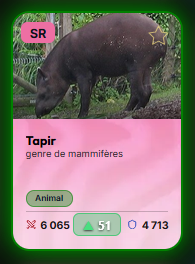
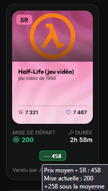

# Wikimasters Helper

Wikimasters Helper est un UserScript (extension Tampermonkey) conçu pour enrichir et optimiser l'interface du jeu par navigateur Wikimasters.

Il ajoute des outils d'aide à la décision économique, le suivi des prix moyens et des tendances sur le marché, ainsi qu'une mise en valeur visuelle de votre collection de cartes.

---

## Fonctionnalités actuelles

- Prix moyens et tendances en temps réel :
  - Sur la Collection et le Marketplace (vue liste) : Affichage d'un badge interactif indiquant le prix moyen de la carte, l'ancienneté de la donnée et la tendance sur 24h et 7 jours.
  - Sur le Marketplace (vue enchère) : 
    - Côté acheteur : Comparaison en direct entre l'enchère courante et le prix moyen (exemple : +1 500 sous la moyenne).
    - Côté vendeur : Affichage du prix moyen pour vous aider à fixer votre prix de mise en vente.
- Mise en valeur visuelle (Halos) :
  - Trait lumineux ou halo personnalisé autour des cartes selon vos Favoris (jaune) et vos Tags ou Labels de collection.
- Système de Cache et Auto-Update :
  - Stockage local (localStorage) pour réduire les requêtes API.
  - Code couleur sur les badges selon la fraîcheur des données de prix.
  - Gestion automatique du Rate Limit (backoff exponentiel) pour éviter le blocage des requêtes.
  - Clic droit sur les badges de prix pour forcer l'actualisation manuelle.

---

## Installation

1. Installez un gestionnaire de UserScripts dans votre navigateur (Tampermonkey, Violentmonkey ou Greasemonkey).
2. Installez le script via le lien brut direct vers le fichier :
   https://raw.githubusercontent.com/nicof79/wikimasters-helper/main/wikimasters-helper.user.js
3. La fenêtre du gestionnaire s'ouvre, cliquez sur Installer.
4. Lancez ou rafraîchissez la page du jeu Wikimasters.

---

## Aperçu

| Vue Collection (Prix & Halos) | Vue Marketplace (Comparateur) |
| :---: | :---: |
|  |  |

---

## Structure du projet

wikimasters-helper/
├── assets/                       # Captures d'écran pour la documentation
├── wikimasters-helper.user.js    # Code source du UserScript
├── .gitignore                    # Fichiers ignorés par Git
├── LICENSE                       # Licence MIT
└── README.md                     # Documentation du dépôt

---

## Développement & Contributions

Les contributions, signalements de bugs et suggestions sont les bienvenus.

1. Ouvrez une Issue sur GitHub pour signaler un problème ou proposer une amélioration.
2. Pour contribuer au code, créez un fork du projet, ajoutez vos modifications dans une branche dédiée puis ouvrez une Pull Request.

---

## Licence

Ce projet est distribué sous licence MIT. Voir le fichier LICENSE pour plus de détails.